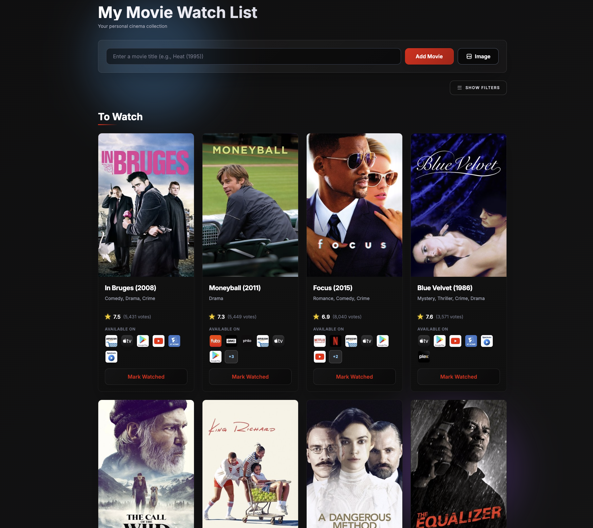

# Movie Watchlist

A web application to track movies you want to watch and have watched, with movie data from TMDb and intelligent parsing powered by OpenAI.



## Live Demo
[mymoviewatch.com](https://www.mymoviewatch.com/)

## Video Tutorial
[Full step-by-step build guide on YouTube](https://youtu.be/7NioPNaskeY)

## Features

- **Smart Movie Addition**: Add movies using natural language or URLs
- **Poster-first Design**: Clean, modern card layout
- **Streaming Info**: Shows where movies are available to watch
- **Simple Lists**: "To Watch" and "Watched" lists
- **SQLite Storage**: Lightweight database storage
- **Responsive**: Works on desktop, tablet, and mobile

## Setup

### Prerequisites

- Node.js (v14+)
- npm
- OpenAI API key
- TMDb API key

### Installation

1. Clone the repository
```bash
git clone https://github.com/yourusername/movie-watchlist-open-source.git
cd movie-watchlist-open-source
```

2. Install dependencies
```bash
npm install
```

3. Set up environment variables
```bash
cp .env.example .env
```

Edit `.env` and add your API keys:
- **OpenAI API Key**: Get from [platform.openai.com/api-keys](https://platform.openai.com/api-keys)
- **TMDb API Key**: Get from [themoviedb.org/settings/api](https://www.themoviedb.org/settings/api)

4. Run the app
```bash
npm start
```

App runs on `http://localhost:3000`

## Usage

### Adding Movies
- Type a movie title: "Heat (1995)"
- Paste a URL with movie info
- Enter natural language: "that new Batman movie"

### Managing Lists
- New movies appear in "To Watch"
- Click toggle button to mark as "Watched"
- Movies persist across sessions

## Tech Stack

- **Backend**: Node.js, Express
- **Database**: SQLite
- **Frontend**: HTML, Tailwind CSS (v3.4), Vanilla JavaScript
- **APIs**: OpenAI (extraction), TMDb (movie data)

## Configuration

| Variable | Description | Default |
|----------|-------------|---------|
| `PORT` | Server port | 3000 |
| `OPENAI_API_KEY` | OpenAI API key | Required |
| `TMDB_API_KEY` | TMDb API key | Required |
| `TMDB_ACCESS_TOKEN` | TMDb access token | Optional |
| `WATCH_REGION` | Streaming region | US |

## Deployment

This app can be deployed to any Node.js hosting service. For deployment examples and GitHub Actions setup, see the live version.

## Resources

- **PRD**: [Original Product Requirements Document](https://docs.google.com/document/d/1ZCcg6I45oIdsj_bOv1PSnPHLPoqOkEmuHq9gwe-kvbY/edit?usp=sharing)
- **Tutorial**: [Step-by-step build guide on YouTube](https://youtu.be/7NioPNaskeY)
- **Vibe Coding**: Part of the Act Two Vibe Coding curriculum

## Author

Built by [Louie Bacaj](https://github.com/lbacaj) with help from Claude Code and ChatGPT

## License

MIT